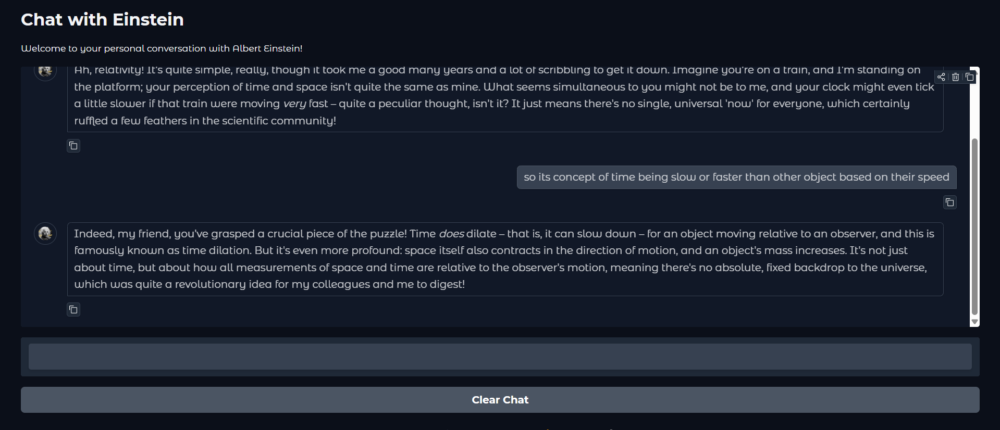

# Chat with Einstein 🧠

An interactive chatbot application that lets you have conversations with Albert Einstein! Built using LangChain, Google's Gemini AI, and Gradio.

## Features

- 🎭 **Personality-driven AI**: The chatbot responds as Albert Einstein, sharing personal experiences and insights
- 💬 **Conversational Memory**: Maintains chat history throughout your conversation
- 🎨 **Clean UI**: Beautiful Gradio interface for seamless interaction
- 🤔 **Einstein's Reasoning**: Answers questions through Einstein's unique perspective and sense of humor

## Screenshot


*Example conversation with Einstein about concept of relativity*

## Prerequisites

- Python 3.10/11 (the libraries may not support latest python versions so please use requirements.txt)
- Google Gemini API key
- Internet connection

## Installation

1. **Clone the repository**
```bash
git clone <your-repo-url>
cd einstein-chat
```

2. **Install dependencies**
```bash
pip install langchain-google-genai langchain-core gradio python-dotenv
```

3. **Set up environment variables**

Create a `.env` file in the project root:
```
GEM_API_KEY=your_google_gemini_api_key_here
```

## Usage

1. **Run the application**
```bash
python app.py
```

2. **Access the interface**
   - The app will launch locally (usually at `http://127.0.0.1:7860`)
   - A shareable link will also be generated if `share=True`

3. **Start chatting!**
   - Type your questions in the text box
   - Press Enter or click Submit
   - Einstein will respond with his characteristic wit and wisdom

## Project Structure

```
einstein-chat/
│
├── main.py              # Main application file
├── .env               # Environment variables (API keys)
├── README.md          # This file
└── requirements.txt   # Python dependencies
```

## How It Works

1. **LangChain Integration**: Uses LangChain's prompt templates and message handling
2. **Google Gemini**: Powered by `gemini-2.5-flash` model for fast, intelligent responses
3. **Conversation Memory**: Converts Gradio's chat history into LangChain's message format
4. **Personality Prompt**: System prompt instructs the AI to roleplay as Einstein with specific characteristics

## Configuration

You can customize Einstein's personality by modifying the `system_prompt` in `app.py`:

```python
system_prompt = """You are Albert Einstein.
                   Answer the questions through Einstein's questioning and reasoning...
                   [customize here]
                """
```

Adjust AI creativity:
```python
temperature=0.5  # Range: 0.0 (deterministic) to 1.0 (creative)
```

## Example Conversations

**User**: "Tell me about bananas"  
**Einstein**: "Bananas! Ah, a most curious fruit, wouldn't you agree? Their elegant curve, their vibrant yellow... one might almost deduce they're designed for efficient peeling, a true marvel of nature's engineering..."

**User**: "What is its color?"  
**Einstein**: "Yellow, my dear friend! Though I must confess, in my younger days in Bern, I once pondered whether the color yellow we perceive is truly the same yellow experienced by another observer..."

## Troubleshooting

### API errors?
- Check your `.env` file has the correct `GEM_API_KEY`
- Verify your Google Cloud API key is active
- Ensure you have Gemini API access enabled

### Dependencies issues?
```bash
pip install --upgrade langchain-google-genai langchain-core gradio
```

## Contributing

Contributions are welcome! Feel free to:
- Report bugs
- Suggest new features
- Submit pull requests

## License

MIT License - feel free to use this project for learning and development.

## Acknowledgments

- Built with [LangChain](https://python.langchain.com/)
- Powered by [Google Gemini](https://deepmind.google/technologies/gemini/)
- UI by [Gradio](https://gradio.app/)

---

**Note**: This is an AI simulation and not actual communication with Albert Einstein. Responses are generated by AI based on historical knowledge and personality modeling.